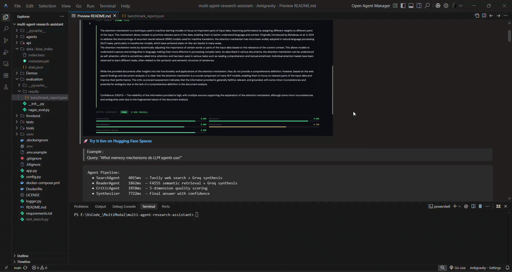

# ⚡ RAG Harness

> Evaluate any RAG system in seconds — no strict format.

[](https://pypi.org/project/rag-harness/)
[]()
[]()
[]()

---

## 🚀 Why RAG Harness?

Evaluating RAG systems is messy.

* Different formats everywhere ❌
* No simple CLI tools ❌
* Hard to compare outputs ❌
* Most tools require APIs ❌

👉 **RAG Harness fixes that.**

**Just give your model output → get evaluation instantly.**
  
---

## 📦 Install

```bash
pip install rag-harness
```
## 📊 Score Interpretation Guide
RAG Harness uses deterministic scoring, which is typically **stricter than LLM-based evaluation**.
### ⚠️ Note

- Scores may appear lower than LLM-based evaluators  
- Deterministic scoring is stricter and reproducible  
- LLM-based evaluation may give higher scores due to semantic reasoning  

👉 Example:

A score of **~0.5** in RAG Harness often corresponds to **reasonably good semantic answers**, even if not perfectly aligned token-wise.

---

## 🎥 Demo



---

## ✨ Features

* ⚡ One-command evaluation
* 🧠 RAGAS-style scoring (no API required)
* 🔍 Works with ANY JSON / JSONL / CSV
* 🔄 Auto-detects ground truth
* 📊 Exact Match + F1 + Fuzzy + Context metrics
* ⚔️ Compare multiple RAG systems
* 🧩 Handles messy real-world outputs (LangChain, LlamaIndex, custom)

---

## ⚡ Quick Start

```bash
rag-harness evaluate output.json
```

---

## ▶️ Run Evaluation

### 1. Evaluate predictions only

```bash
rag-harness evaluate predictions.json
```

### 2. Full evaluation (recommended)

```bash
rag-harness evaluate predictions.json --dataset dataset.json
```

### 3. Compare systems

```bash
rag-harness compare dataset.json pred_a.json pred_b.json
```

---

## 📊 Example Output

```
📊 RAG Evaluation Summary

Total             3
F1 Score          0.34
Fuzzy Score       0.60
Context Recall    0.00

🧠 RAGAS Score    0.47
```

### 🧠 Insights

* Answers are semantically correct but not precise
* No context detected → retrieval not evaluated

---

## 📁 Supported Input Formats

RAG Harness automatically detects:

* answer, generated_answer, response
* ground_truth, expected_answer
* contexts, documents, source_documents

Works with:

* LangChain outputs
* LlamaIndex outputs
* Custom RAG pipelines
* Benchmark JSON logs

👉 No strict schema required.

---

## 🧾 Example Formats

### Predictions + Ground Truth

```json
{
  "generated_answer": "...",
  "ground_truth": "...",
  "contexts": ["..."]
}
```

### Predictions only

```json
{
  "answer": "...",
  "contexts": ["..."]
}
```

### ⚠️ Note

* Without ground truth → limited evaluation
* With ground truth → full evaluation

---

## 🧠 Scoring

RAG Harness approximates RAGAS using:

* Exact Match
* F1 Score
* Fuzzy Semantic Matching
* Context Recall

### ⚠️ Important

* Fully deterministic (no API required)
* Faster and reproducible
* Scores may differ from LLM-based RAGAS

---

## ⚔️ Compare Systems

```bash
rag-harness compare dataset.json pred_a.json pred_b.json
```

```
⚔️ RAG Systems Comparison

Metric        A      B
------------------------
F1 Score      0.83   0.45
RAGAS Score   0.72   0.51

🏆 System A wins
```

---

## 🚧 Roadmap

* [ ] LLM-based evaluation (user-provided API key)
* [ ] Per-question analysis
* [ ] HTML reports
* [ ] Leaderboard mode

---

## 🤝 Contributing

PRs, ideas, and improvements are welcome!

---

## 👨‍💻 Author

Built by Abhishek — focused on practical AI tooling for real-world systems.

---

⭐ If this helped you evaluate your RAG system, consider starring the repo!
