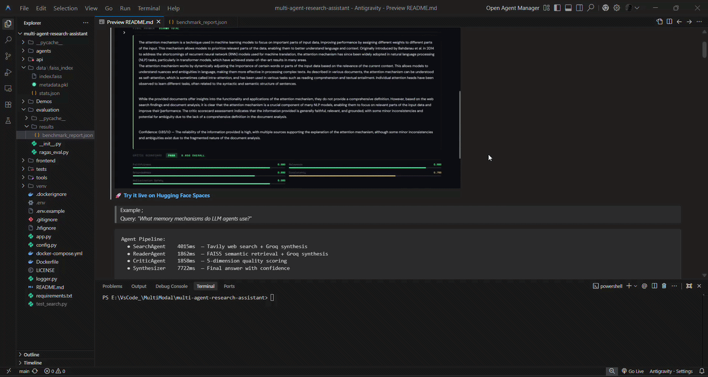

# ⚡ RAG Harness

> Evaluate RAG systems in seconds — fast, deterministic, and without requiring an API key.

[](https://pypi.org/project/rag-harness/)
[]()
[]()
[]()
[](https://pepy.tech/projects/rag-harness)
---

Evaluating RAG systems shouldn't require paid APIs, rigid schemas, or complicated evaluation pipelines.

RAG Harness is a lightweight CLI that evaluates your RAG outputs using deterministic metrics, automatically detects common dataset formats, and provides human-readable diagnostics to help you understand why your system succeeds or fails.

### Why choose RAG Harness?

- No API key required
- Fully deterministic and reproducible
- Works offline
- Works with common RAG formats automatically
- Great for local development and CI

👉**Just give your model output → get evaluation instantly.**  
  
  ✓ Offline  
  ✓ Deterministic  
  ✓ CI-friendly  
  ✓ No API  

---

## 📦 Install

```bash
pip install rag-harness
```
## 📊 Score Interpretation Guide
RAG Harness uses deterministic scoring, which is typically **stricter than LLM-based evaluation**.
### ⚠️ Note

- Scores may appear lower than LLM-based evaluators  
- Deterministic scoring is stricter and reproducible  
- LLM-based evaluation may give higher scores due to semantic reasoning  

👉 Example:

A score of **~0.5** in RAG Harness often corresponds to **reasonably good semantic answers**, even if not perfectly aligned token-wise.

---

## 🎥 Demo



---

## ✨ Features

* ⚡ One-command evaluation
* 🧠 RAGAS-style scoring (no API required)
* 🔍 Works with most JSON / JSONL / CSV RAG outputs
* 📋 Rich CLI summaries
* 💡 Human-readable diagnostics
* 🔥 Top Failed Examples
* 🔄 Auto-detects ground truth
* 📊 Exact Match + F1 + Fuzzy + Context metrics
* ⚔️ Compare multiple RAG systems
* 🧩 Handles messy real-world outputs (LangChain, LlamaIndex, custom)

---

## ▶️ Quick Start

### 1. Evaluate predictions only

```bash
rag-harness evaluate examples/predictions_a.jsonl
```

### 2. Full evaluation (recommended)

```bash
rag-harness evaluate examples/predictions_a.jsonl --dataset examples/dataset.jsonl
```

### 3. Detailed diagnostics (verbose mode)

```bash
rag-harness evaluate examples/predictions_a.jsonl --dataset examples/dataset.jsonl --verbose
```

Displays:

* 📊 Rich evaluation summary
* 💡 Human-readable diagnostics
* 🔥 Top Failed Examples
* 🟢 Overall verdict for each failed example

### 4. Compare two RAG systems

```bash
rag-harness compare examples/dataset.jsonl examples/predictions_a.jsonl examples/predictions_b.jsonl
```

---

## 📊 Example Output

```
📊 RAG Evaluation Summary

Total             3
F1 Score          0.34
Fuzzy Score       0.60
Context Recall    0.00

🧠 RAGAS Score    0.47
```

### 🧠 Insights

* Answers are semantically correct but not precise
* No context detected → retrieval not evaluated

---

## 📁 Supported Input Formats

RAG Harness automatically detects:

* answer, generated_answer, response
* ground_truth, expected_answer
* contexts, documents, source_documents

Works with:

* LangChain outputs
* LlamaIndex outputs
* Custom RAG pipelines
* Benchmark JSON logs

👉 No strict schema required.

---

## 🧾 Example Formats

### Predictions + Ground Truth

```json
{
  "generated_answer": "...",
  "ground_truth": "...",
  "contexts": ["..."]
}
```

### Predictions only

```json
{
  "answer": "...",
  "contexts": ["..."]
}
```

### ⚠️ Note

* Without ground truth → limited evaluation
* With ground truth → full evaluation

---

## 🧠 Scoring

RAG Harness approximates RAGAS using:

* Exact Match
* F1 Score
* Fuzzy Semantic Matching
* Context Recall

### ⚠️ Important

* Fully deterministic (no API required)
* Faster and reproducible
* Scores may differ from LLM-based RAGAS

---

## ⚔️ Compare Systems

```bash
rag-harness compare dataset.json pred_a.json pred_b.json
```

```
⚔️ RAG Systems Comparison

Metric        A      B
------------------------
F1 Score      0.83   0.45
RAGAS Score   0.72   0.51

🏆 System A wins
```

---

## 🚧 Roadmap

### Completed

- ✅ Rich CLI output
- ✅ Human-readable diagnostics
- ✅ Overall verdicts
- ✅ Top Failed Examples
- ✅ Compare multiple systems

### Coming Soon

- ⏳ Rich metrics dashboard
- ⏳ HTML reports
- ⏳ Dataset Doctor
- ⏳ CSV / Markdown export
- ⏳ Optional LLM evaluation  

---

## 🤝 Contributing

PRs, ideas, and improvements are welcome!

---

## 👨‍💻 Author

Built by Abhishek Bevinkatti 

---

If this helped you evaluate your RAG system, consider starring ⭐ the repo!
